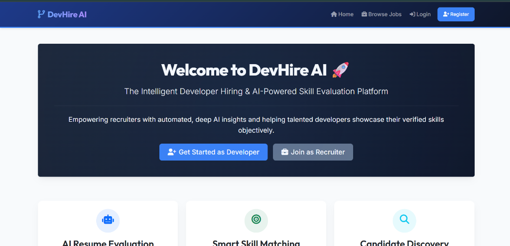
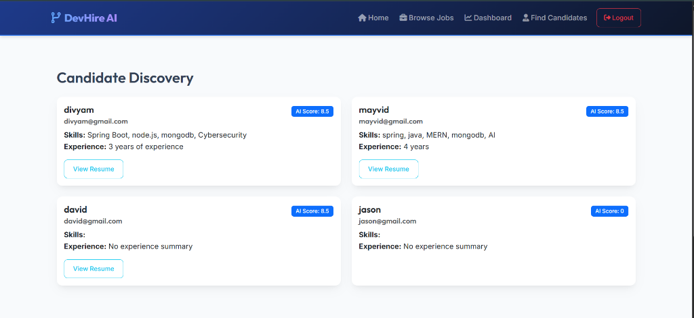

# DevHire AI 🚀

**Intelligent Developer Hiring & AI-Powered Skill Evaluation Platform**

DevHire AI is a modern web application designed to bridge the gap between recruiters and developer talent. It utilizes state-of-the-art AI (Groq Llama-3.3) to evaluate profiles and parse uploaded resumes in real-time, assigning a verified skill compatibility score. All resumes are stored securely in Cloudinary storage for instant, serverless-ready document rendering.

🔗 **Live URL:** [https://devhire-ai-nine.vercel.app/](https://devhire-ai-nine.vercel.app/)

---

## 📸 Screenshots

### Modern Homepage (Guest View)


### Candidate Discovery Dashboard (Recruiter View)


---

## 🌟 Key Features

### For Recruiters
* **Interactive Job Postings:** Easily publish new opportunities with detailed skill requirements and experience constraints.
* **Applicant Scoreboards:** Applicants are automatically ranked using AI-calculated profile matching scores.
* **Talent Pool Discovery:** Search and filter candidates by verified AI scores and summaries.
* **Cloud Resume Viewer:** View candidate resumes instantly via unified cloud-hosted links.

### For Developers
* **AI Profile Auditing:** Upload a resume to receive real-time scoring, skill mapping, and strengths/weaknesses breakdown from Groq AI.
* **Verifiable Profiles:** Set up your bio, experience, skills, GitHub details, and portfolio links in a single location.
* **Instant Applications:** Browse open listings and apply with a single click.

---

## 🛠️ Technology Stack

* **Backend Engine:** Node.js & Express.js
* **Database Management:** MongoDB Atlas (via Mongoose ODM)
* **AI Orchestration:** Groq SDK (`llama-3.3-70b-versatile` model)
* **Cloud Asset Management:** Cloudinary API (handling stream-based buffer uploads)
* **Frontend Presentation:** EJS Templates with custom modern CSS and Bootstrap 5.3 CDN
* **Secure Authentication:** Passport.js (Local Session Strategy) & Bcrypt password encryption

---

## ⚙️ Local Configuration & Setup

### 1. Prerequisites
Ensure you have **Node.js (v18+)** and **npm** installed.

### 2. Environment Setup
Create a `.env` file in the root directory and configure the following variables:
```env
PORT=3000
MONGODB_URI=your_mongodb_connection_string
SESSION_SECRET=your_session_secret
GROQ_API_KEY=your_groq_api_key
CLOUDINARY_CLOUD_NAME=your_cloudinary_cloud_name
CLOUDINARY_API_KEY=your_cloudinary_api_key
CLOUDINARY_API_SECRET=your_cloudinary_api_secret
```

### 3. Installation
Install the project dependencies:
```bash
npm install
```

### 4. Running the Application
Start the development server:
```bash
npm start
```
Open your browser and navigate to `http://localhost:3000`.

---

## 🚀 Deploying to Vercel
This project is configured out-of-the-box for serverless deployment on Vercel:
1. Link your GitHub repository to your Vercel Dashboard.
2. Under **Project Settings -> Environment Variables**, add the variables configured in your `.env` file.
3. Click **Deploy**. Vercel will build the serverless functions and serve the EJS views instantly.

---

*Made with passion by **Divyam***